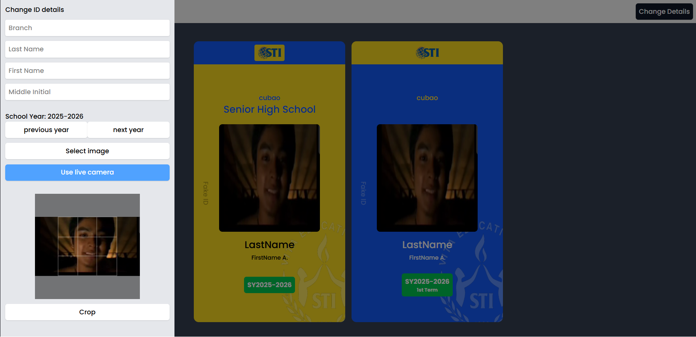

# STI-ID-FRAME

A modern web application for ID frame management and processing. Built with React, Vite, and Tailwind CSS.

**Live Demo:** [https://id-frame.vercel.app](https://id-frame.vercel.app)

## 📸 Screenshots

<!-- Add your application screenshots here -->

### Main Interface


## ✨ Features

- **Modern React Setup** - Built with React 19 and Vite for fast development and production builds
- **Image Cropping** - Integrated image cropping functionality with `react-easy-crop`
- **Responsive Design** - Tailwind CSS for responsive and customizable styling
- **Routing** - Client-side routing with React Router for seamless navigation
- **Development Tools** - ESLint configuration for code quality

## 🚀 Quick Start

### Prerequisites
- Node.js (v16 or higher)
- npm or yarn

### Installation

1. Clone the repository:
```bash
git clone https://github.com/barcs-19/STI-ID-FRAME.git
cd STI-ID-FRAME
```

2. Install dependencies:
```bash
npm install
```

3. Start the development server:
```bash
npm run dev
```

The application will be available at `http://localhost:5173`

## 📦 Available Scripts

- `npm run dev` - Start the development server with hot module replacement (HMR)
- `npm run build` - Build the application for production
- `npm run preview` - Preview the production build locally
- `npm run lint` - Run ESLint to check code quality

## 🛠️ Technology Stack

### Frontend Framework
- **React** (v19.1.1) - UI library
- **React Router DOM** (v7.9.1) - Client-side routing
- **Vite** (v7.1.2) - Build tool and dev server

### Styling
- **Tailwind CSS** (v4.1.13) - Utility-first CSS framework
- **@tailwindcss/vite** (v4.1.13) - Tailwind CSS Vite plugin

### Image Processing
- **react-easy-crop** (v5.5.1) - Image cropping library

### Development Tools
- **ESLint** (v9.33.0) - Code linting
- **@vitejs/plugin-react** (v5.0.0) - React Fast Refresh for Vite

## 📁 Project Structure

```
STI-ID-FRAME/
├── src/                    # Source code
│   ├── components/        # React components
│   ├── pages/            # Page components
│   ├── styles/           # CSS files
│   └── main.jsx          # Application entry point
├── public/               # Static assets
├── index.html            # HTML template
├── vite.config.js        # Vite configuration
├── tailwind.config.js    # Tailwind CSS configuration
├── eslint.config.js      # ESLint configuration
├── package.json          # Project dependencies
└── README.md             # This file
```

## 🔧 Configuration

### Vite Configuration
The project uses Vite for fast builds and development. Configuration is in `vite.config.js`.

### Tailwind CSS
Styling is managed with Tailwind CSS. Customize your theme in `tailwind.config.js`.

### ESLint
Code quality is maintained with ESLint. Rules are configured in `eslint.config.js`.

## 📝 Development Guidelines

1. **Code Style** - Run `npm run lint` to check code quality before committing
2. **Components** - Create reusable components in the `src/components/` directory
3. **Styling** - Use Tailwind CSS utility classes for styling
4. **Routing** - Add new routes in the router configuration

## 🐛 Troubleshooting

### Port Already in Use
If port 5173 is already in use, Vite will automatically use the next available port.

### Build Errors
- Clear `node_modules/` and reinstall: `rm -rf node_modules && npm install`
- Clear Vite cache: `rm -rf .vite`
- Rebuild: `npm run build`

### ESLint Issues
Run `npm run lint` to see all linting errors and warnings.

## 📄 License

This project is licensed under the MIT License - see the LICENSE file for details.

## 👤 Author

**barcs-19**
- GitHub: [@barcs-19](https://github.com/barcs-19)

## 🤝 Contributing

Contributions are welcome! Feel free to:
1. Fork the repository
2. Create your feature branch (`git checkout -b feature/AmazingFeature`)
3. Commit your changes (`git commit -m 'Add some AmazingFeature'`)
4. Push to the branch (`git push origin feature/AmazingFeature`)
5. Open a Pull Request

## 📞 Support

For support, questions, or feedback, please open an issue on the [GitHub Issues](https://github.com/barcs-19/STI-ID-FRAME/issues) page.

---

**Last Updated:** 2026-07-24
